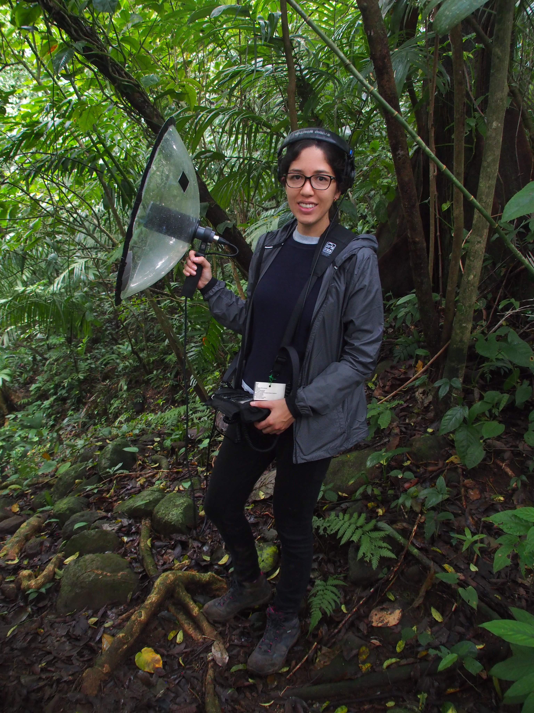

+++
# A Demo section created with the Blank widget.
# Any elements can be added in the body: https://sourcethemes.com/academic/docs/writing-markdown-latex/
# Add more sections by duplicating this file and customizing to your requirements.

widget = "blank"  # See https://sourcethemes.com/academic/docs/page-builder/
headless = true  # This file represents a page section.
active = false # Activate this widget? true/false
weight = 20  # Order that this section will appear.

title = ""
subtitle = ""

[design]
  # Choose how many columns the section has. Valid values: 1 or 2.
  columns = "1"

[design.background]
  # Apply a background color, gradient, or image.
  #   Uncomment (by removing `#`) an option to apply it.
  #   Choose a light or dark text color by setting `text_color_light`.
  #   Any HTML color name or Hex value is valid.

  # Background color.
  # color = "navy"
  
  # Background gradient.
  # gradient_start = "DeepSkyBlue"
  # gradient_end = "SkyBlue"
  
  # Background image.
  image = ""  # Name of image in `static/img/`.
  image_darken = 0.6  # Darken the image? Range 0-1 where 0 is transparent and 1 is opaque.

  # Text color (true=light or false=dark).
  text_color_light = false

[design.spacing]
  # Customize the section spacing. Order is top, right, bottom, left.
  padding = ["20px", "0", "20px", "0"]

[advanced]
 # Custom CSS. 
 css_style = ""
 
 # CSS class.
 css_class = "mini"
+++

I am a data analyst with experience in marketing and ecology. I currently work at [Kantar](https://www.kantar.com/) where I do software development with R, before that I worked in CONABIO (Mexico’s National Commission of Biodiversity) doing statistical analysis related to biodiversity. My interests include Statistical modeling (hierarchical models, spatial statistics, Bayesian networks), Survey design and Survey data analysis, Machine learning, and Data visualization. 

I enjoy teaching, I teach statistic courses to master students in Data Science and to bachelors in Mathematics and Actuarial Sciences at [ITAM](https://cienciadedatos.itam.mx/es/71/contenido/plan-de-estudios-de-la-licenciatura-en-ciencia-de-datos-del-itam). I collaborate with the Mexican *Community of Bioinformatics Software Developers* [CDSB](https://comunidadbioinfo.github.io/) teaching R workshops. And often deliver custom R training (introduction to R, survey data analysis in R, maps with R,...), I have trained people with diverse backgrounds: [RMB](https://www.redmexicanadebioinformatica.org/navegando-y-explotando-el-poder-del-tidyverse/), [CONABIO](https://www.gob.mx/conabio), [SAI](http://www.sai.com.mx), [OXFAM Mexico](https://www.oxfammexico.org), [GNP](https://www.gnp.com.mx), [SAT](https://www.sat.gob.mx/home) and [COLMEX](https://www.colmex.mx).

Lastly, I :heart R, I am co-organizer of [R-Ladies CDMX](http://meetup.com/rladiescdmx/) and I regularly give talks related to R.

<figure>

  <figcaption class="figure-caption text-center">Recording birds, not my day to day.</figcaption>
</figure>
